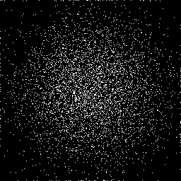
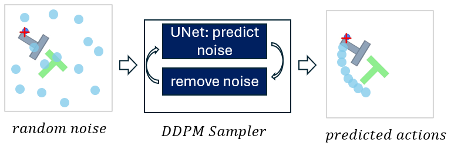

### Neural Network course project

This project was done as a course project for CS-852, Fall-2024, UNH to better understand diffusion policy.

In the first step for sanity checking I let the diffusion model to generate some simple data. Then I use the same model to generate actions as a diffusion policy.

### Quick start: Diffusion Model Sanity check
```bash
my_swissroll.ipynb
```



### Diffusion Policy


Diffusion policy reimplementation for the course project of the Neural Network course.


Based on the paper: [Visuomotor Policy Learning via Action Diffusion](https://diffusion-policy.cs.columbia.edu/)




### Installation
* For pushT environment install the original diffusion policy codebase from [here](https://github.com/real-stanford/diffusion_policy)


### Data download
* download the pusht data and put it inside the data folder
```bash
wget https://diffusion-policy.cs.columbia.edu/data/training/pusht.zip
```
* convert to hdf5 format: Use the zarr2hdf5.ipynb notebook


### How to run the code

* Option 1: jupyter notebook
```bash
train_example.ipynb jupyter 
```
 
* Option 2: train.py script
```bash
python train.py --hdf5_file data/pusht/pusht_v7_zarr_206.hdf5
```


### File structure
| File name | Description |
| --- | --- |
| my_swissroll.ipynb | Sanity check for the diffusion model |
| train.py | Main script to train the model |
| train_example.ipynb | Jupyter notebook with the training example |
| myddpm.py | DDPM scheduler and sampler |
| noise_predictor_model.py | UNet model |
| pos_encoding.py | Sinusoidal positional encoding |
| film.py | Fiture wise Linear Modulation (FiLM) |
| vision_model.py | Vision encoder |
| pusht_data_utils.py | Utility functions from original diffusion policy codebase|
| data/pusht/pusht_v7_zarr_206.hdf5 | pusht data in hdf5 format |
| zarr2hdf5.ipynb | Convert zarr to hdf5 format |
